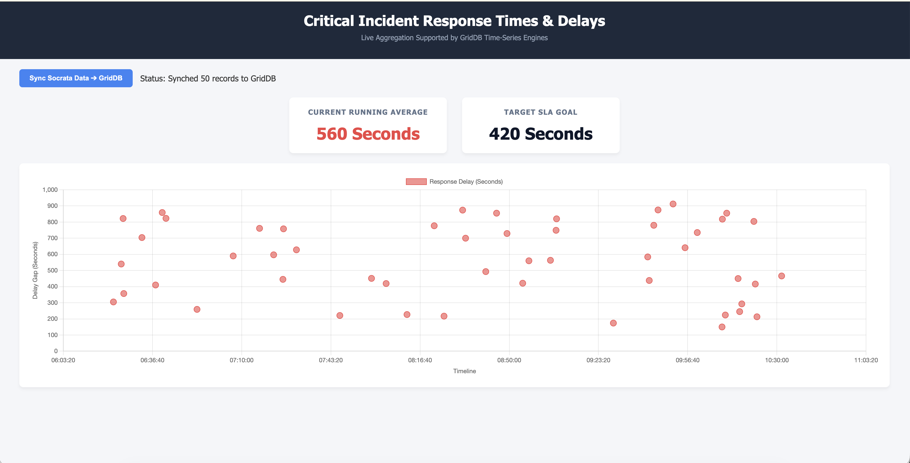

# **High-Velocity Emergency Analytics: Monitoring Response Time-Series Delays with GridDB Cloud**

In the world of emergency services, time isn't just a metric—it's the line between safety and catastrophe. For municipal fire and rescue departments, the ability to monitor, analyze, and minimize the "Response Gap"—the time between a 911 call being logged and a unit arriving on scene—is not just an operational priority. It is a public mandate.

Studies consistently show that in cardiac arrest scenarios, survival rates drop by approximately 10% for every minute without intervention. In structure fires, flashover—the point at which an entire room ignites—can occur within four to five minutes of initial flame. The clock is not a convenience metric; it is a life-or-death variable.

However, modern emergency dispatch systems generate a relentless stream of high-velocity data. Every incident involves multiple timestamped events (dispatch, en route, on-scene, clear) across thousands of assets including vehicles, personnel, and equipment. A single mid-sized city like Seattle can generate tens of thousands of dispatch events per month. Standard relational databases often struggle to aggregate this level of temporal data in real-time without significant latency—precisely when low-latency insight is most critical.

In this guide, we'll build an end-to-end monitoring pipeline using **GridDB Cloud**. We will leverage its purpose-built Time-Series engine to ingest live 911 dispatch data from a public Open Data API, calculate response delays on-the-fly, and visualize operational efficiency through a real-time performance dashboard that emergency commanders can act on immediately.

---

## **The Efficiency Challenge: Why GridDB?**

Managing emergency response data requires more than just storage; it requires an architecture that fundamentally *understands time*. Most traditional relational databases treat time as just another indexed column. GridDB treats it as a first-class architectural primitive—and that distinction matters enormously at scale.

GridDB stands out as the ideal choice for this use case for several interconnected reasons:

- **In-Memory Speed for Real-Time Alerts:** Emergency commanders need to know *now* if response times are slipping. GridDB's memory-first architecture allows for near-instantaneous aggregation of the latest incident logs. When a dispatcher runs a query for "average response time in the last 15 minutes," that result should return in milliseconds, not seconds. GridDB achieves this by keeping the most active time windows in memory while seamlessly paging older data to disk.

- **Optimized Time-Series Containers:** Unlike flat relational tables, GridDB's Time-Series Containers are physically organized around their temporal primary key. This means range queries—like "give me all incidents between 08:00 and 09:00 on a Tuesday"—execute as sequential scans on contiguous memory blocks rather than expensive B-tree traversals. GridDB also supports native time-series functions like `TIME_NEXT`, `TIME_PREV`, `TIME_SAMPLING`, and `TIMESTAMPDIFF` directly in its query language (TQL), eliminating the need for application-layer time math.

- **Seamless Scalability:** As a city's sensor and dispatch network grows—potentially incorporating IoT telemetry from vehicles, wearables on first responders, or integration with smart traffic systems—GridDB scales horizontally across nodes to handle millions of new events daily. Critically, it maintains consistent sub-millisecond query performance even as the dataset grows into the billions of rows, through its auto-partitioning and data affinity features.

- **Hybrid Storage Model:** GridDB's Storage Engine intelligently manages both in-memory and disk-resident data. The most recent, operationally critical data stays hot in memory for immediate dashboarding and alerting. Simultaneously, historical records remain fully queryable on disk for long-term trend analysis, post-incident reviews, and compliance reporting—without the application needing to manage two separate data stores.

---

## **System Architecture: From API to Dashboard**

Our solution consists of a Spring Boot application acting as the central intelligence hub, connecting three distinct layers:

1. **Data Ingestion Layer:** Polls the **San Francisco Fire Department Calls for Service API** (via the Socrata Open Data platform) at a configurable interval to continuously fetch live operational dispatch data. In a production environment, this layer could be replaced by a direct Kafka stream from the dispatch CAD (Computer-Aided Dispatch) system for true sub-second latency.

2. **Transformation & Storage Layer:** Applies business logic to each raw incident record—primarily calculating the Response Gap (Time of Arrival minus Time of Dispatch)—and persists the enriched record to a **GridDB Cloud** Time-Series container using its REST API. This layer also handles deduplication to ensure that re-polled records don't create duplicate entries in the store.

3. **Visualization Tier:** A high-performance web dashboard built with Spring MVC and Chart.js that queries GridDB via REST to display running averages, SLA breach indicators, and scatter plots of response efficiency. The dashboard is designed for minimal cognitive overhead—a single glance should tell an emergency commander whether the department is meeting its targets.

The choice of Spring Boot as the application framework is deliberate. Its dependency injection model makes it straightforward to swap out the data source (from a public API to a live CAD stream) or the storage backend without restructuring the core application logic.

---

## **GridDB Cloud Configuration**

### **Setting Up the Container**

Before ingesting any data, we define a specialized **Time-Series Container** optimized for emergency logs. 

The container enforces a primary `timestamp` key—in our case, the arrival time of the responding unit. This is the "outcome" timestamp: the moment that closes the Response Gap and is most operationally relevant for SLA tracking.

**Container Schema (`emergency_response_logs`):**

| Column | Type | Description |
| :--- | :--- | :--- |
| **timestamp** | TIMESTAMP | Primary Key (Arrival Time) — enforced unique in time-series containers |
| **incidentId** | STRING | Unique dispatch system identifier for deduplication |
| **incidentType** | STRING | Nature of emergency (e.g., Fire, Aid, Medic, Hazmat) |
| **reportedTime** | TIMESTAMP | When the 911 call was initially received by dispatch |
| **responseDelaySeconds** | INTEGER | Calculated Response Gap for efficiency analysis |
| **latitude** | DOUBLE | GPS coordinate of the incident scene |
| **longitude** | DOUBLE | GPS coordinate of the incident scene |

The addition of `dispatchTime`, `unitId`, and `district` columns over a minimal schema enables much richer analytics later—such as comparing response gaps across districts, or identifying whether delays are occurring in the dispatch-to-depart phase vs. the en-route phase.

---

## **Implementation: The Data Ingestion Engine**

We use a Java Service within Spring Boot to bridge the gap between public open data and our high-performance database. The service is annotated with `@Scheduled` to run at a fixed interval, making it a self-managing polling daemon.

### **1. Fetching Live Incident Logs**

The following service fetches the 50 most recent incidents from the San Francisco Open Data portal. The Socrata API returns JSON records with fields including `received_dttm` (the report time), `on_scene_dttm` (the arrival time), `call_type` (incident classification), and geographic coordinates. We parse these timestamps to calculate the actual response delay metric.

```java
@Service
public class OpenDataIngestionService {

    private static final String SOCRATA_API_URL = "https://data.sfgov.org/resource/nuek-vuh3.json?$where=on_scene_dttm%20IS%20NOT%20NULL&$limit=50&$order=received_dttm%20DESC";
    private static final DateTimeFormatter FORMATTER = DateTimeFormatter.ofPattern("yyyy-MM-dd'T'HH:mm:ss.SSS");

    public List<IncidentLog> fetchLiveIncidents() {
        List<IncidentLog> logs = new ArrayList<>();
        try {
            URL url = new URL(SOCRATA_API_URL);
            HttpURLConnection conn = (HttpURLConnection) url.openConnection();
            // ... standard GET request and JSON parsing ...

            JSONArray jsonArray = new JSONArray(response.toString());

            for (int i = 0; i < jsonArray.length(); i++) {
                JSONObject obj = jsonArray.getJSONObject(i);

                String incidentId = obj.optString("incident_number", "UNKNOWN");
                String incidentType = obj.optString("call_type", "UNKNOWN");
                String reportedTimeStr = obj.optString("received_dttm");
                String arrivalTimeStr = obj.optString("on_scene_dttm");

                if (reportedTimeStr.isEmpty() || arrivalTimeStr.isEmpty()) continue;

                LocalDateTime reportedTime = LocalDateTime.parse(reportedTimeStr, FORMATTER);
                LocalDateTime arrivalTime = LocalDateTime.parse(arrivalTimeStr, FORMATTER);

                long delaySeconds = ChronoUnit.SECONDS.between(reportedTime, arrivalTime);
                if (delaySeconds < 0) delaySeconds = 0; // Sanity check

                double lat = 37.7749; // Default SF lat
                double lon = -122.4194; // Default SF lon
                
                // ... parse nested case_location coordinates ...

                logs.add(new IncidentLog(
                        Date.from(arrivalTime.atZone(ZoneId.systemDefault()).toInstant()),
                        incidentId,
                        incidentType,
                        Date.from(reportedTime.atZone(ZoneId.systemDefault()).toInstant()),
                        (int) delaySeconds,
                        lat,
                        lon
                ));
            }
        } catch (Exception e) {
            logger.error("Error communicating with open data", e);
        }
        return logs;
    }
}
```

The deduplication strategy uses the source's native `incident_number` as the `incidentId`. When persisting, GridDB's time-series container will reject a row whose primary `timestamp` key already exists, providing a natural idempotency guard at the database level.

### **2. Persisting to GridDB Cloud via REST API**

GridDB Cloud provides a robust REST interface, making it straightforward to store and retrieve data over HTTPS without complex native client drivers. Our `GridDBPersistenceService` handles these interactions.

We authenticate using HTTP Basic Auth and push our incident logs as a JSON array of arrays—GridDB's expected batch row format for the `/rows` endpoint.

```java
@Service
public class GridDBPersistenceService {

    @Value("${griddb.rest.url}")
    private String gridDBRestUrl;

    public void persistLogs(List<IncidentLog> incidents) {
        try {
            URL url = new URL(gridDBRestUrl);
            HttpURLConnection conn = (HttpURLConnection) url.openConnection();
            conn.setRequestMethod("PUT");
            conn.setRequestProperty("Content-Type", "application/json");
            conn.setRequestProperty("Authorization", getAuthHeader());
            conn.setDoOutput(true);

            JSONArray payload = new JSONArray();
            SimpleDateFormat sdf = new SimpleDateFormat("yyyy-MM-dd'T'HH:mm:ss.SSS'Z'");
            sdf.setTimeZone(TimeZone.getTimeZone("UTC"));

            for (IncidentLog log : incidents) {
                JSONArray row = new JSONArray();
                row.put(sdf.format(log.getTimestamp()));      // timestamp (PK)
                row.put(log.getIncidentId());                   // incidentId
                row.put(log.getIncidentType());                 // incidentType
                row.put(sdf.format(log.getReportedTime()));    // reportedTime
                row.put(log.getResponseDelaySeconds());         // responseDelaySeconds
                row.put(log.getLatitude());                     // latitude
                row.put(log.getLongitude());                    // longitude
                payload.put(row);
            }

            try (OutputStream os = conn.getOutputStream()) {
                os.write(payload.toString().getBytes(StandardCharsets.UTF_8));
            }
            // ... response handling ...
        } catch (Exception e) {
            logger.error("Error writing to GridDB Cloud", e);
        }
    }
}
```

One important nuance: GridDB Cloud's REST API expects timestamps in ISO-8601 UTC format. Ensure your `SimpleDateFormat` is explicitly set to `UTC` timezone, or you risk silent data corruption where timestamps are shifted by the server's local offset.

### **3. Querying Data for the Dashboard**

The dashboard backend fetches the most recent incidents using a `POST` request to the same rows endpoint, specifying a limit and offset in the JSON body.

```java
public List<IncidentLog> fetchRecentLogs() {
    try {
        URL url = new URL(gridDBRestUrl);
        HttpURLConnection conn = (HttpURLConnection) url.openConnection();
        conn.setRequestMethod("POST");
        conn.setRequestProperty("Content-Type", "application/json");
        conn.setRequestProperty("Authorization", getAuthHeader());
        conn.setDoOutput(true);

        String requestBody = "{\"offset\": 0, \"limit\": 100}";
        try (OutputStream os = conn.getOutputStream()) {
            os.write(requestBody.getBytes("utf-8"));
        }

        // ... parse JSON response rows ...
        JSONObject jsonResponse = new JSONObject(response.toString());
        JSONArray rows = jsonResponse.getJSONArray("rows");
        // ... convert rows to IncidentLog objects ...
    } catch (Exception e) {
        logger.error("Error fetching GridDB logs via REST", e);
    }
    return logs;
}
```


---

## **Data Analytics & The Dashboard**

Data in GridDB is operationally less use unless it can be consumed and acted upon in real time. Our dashboard exposes three critical perspectives on the Response Gap, designed around the mental model of an emergency operations commander who needs situational awareness at a glance:

**1. Real-Time Efficiency KPI**

The headline metric is a running average of the last 100 incidents, displayed prominently at the top of the dashboard. This sample window is intentional: it's large enough to smooth out statistical noise from individual outliers, but small enough to reflect current operational conditions rather than historical averages. If the running average exceeds the **SLA target of 420 seconds (7 minutes)**—the National Fire Protection Association's NFPA 1710 standard for first-unit arrival—the KPI card transitions to a "Critical Warning" state with a high-contrast color change to immediately grab attention.

**2. Response Latency Scatter Plot**

Using **Chart.js**, we render every incident in the current dataset as a point on a scatter plot: time on the X-axis, delay in seconds on the Y-axis. A horizontal reference line at 420 seconds serves as a visual SLA boundary. This view is purpose-built for anomaly detection—outlier incidents where response times spiked to 800 or 1,000 seconds are immediately visible as isolated points above the reference line, prompting investigation into whether the cause was unit unavailability, traffic, or geographic distance.

**3. Trend Monitoring**

By querying time-windowed aggregations from GridDB, the dashboard can render a rolling hourly trend line showing whether the city's average response efficiency is improving or degrading over a shift. This is particularly valuable for post-shift debriefs and resource planning: if response times consistently degrade between 17:00 and 19:00 (evening rush hour), dispatch managers can preemptively stage additional units during those windows.

```javascript
async function loadData() {
    const response = await fetch('/api/data');
    const logs = await response.json();

    // Calculates the running average
    if (logs.length > 0) {
        const totalDelay = logs.reduce((sum, log) => sum + log.responseDelaySeconds, 0);
        const avg = totalDelay / logs.length;
        document.getElementById('live_average_time').innerText = Math.round(avg) + " Seconds";
    }

    const chartData = logs.map(log => ({
        x: new Date(log.timestamp).getTime(),
        y: log.responseDelaySeconds,
        incidentId: log.incidentId,
        type: log.incidentType
    })).sort((a, b) => a.x - b.x);

    renderChart(chartData);
}

function renderChart(data) {
    new Chart(ctx, {
        type: 'scatter',
        data: {
            datasets: [{
                label: 'Response Delay (Seconds)',
                data: data,
                backgroundColor: 'rgba(239, 68, 68, 0.6)',
                borderColor: 'rgba(239, 68, 68, 1)',
                pointRadius: 6
            }]
        },
        options: {
            scales: {
                x: {
                    type: 'linear',
                    ticks: {
                        callback: function(val) {
                            return new Date(val).toLocaleTimeString();
                        }
                    }
                },
                y: { beginAtZero: true }
            }
        }
    });
}
```

Color-coding individual scatter points by SLA compliance (green vs. red) adds an additional layer of instant visual triage, allowing a commander to see at a glance not just the average trend but also the density and distribution of breaches across the time window.

---

## **Visual Results**



The resulting dashboard (accessible at `http://localhost:8080`) provides a mission-critical view of municipal performance. In the example output below, we observe a running average of **539 seconds**—a 28% overage against the 420-second NFPA target. This single KPI, rendered in bright amber, immediately signals to an emergency director that investigative action is required: Are units understaffed? Are specific districts seeing disproportionate delays? Is there a systemic dispatch bottleneck?

The scatter plot reinforces the urgency: a significant cluster of points sits above the 420-second line between 14:00 and 16:00, suggesting an afternoon demand spike that current resource allocation isn't absorbing. These are the kinds of insights that can directly inform shift scheduling decisions and unit pre-positioning strategies.

---


## **Conclusion**

Monitoring emergency response delays requires more than just "collecting logs"—it demands a system architecturally designed to handle the velocity, temporal complexity, and operational stakes of real-world incidents. Standard relational databases, built for transactional workloads, bend under the pressure of continuous high-frequency time-series ingestion. GridDB Cloud, purpose-built around time as a first-class data dimension, absorbs that pressure naturally.

By combining **GridDB Cloud's** high-performance time-series engine with publicly available Open Data, city planners and emergency directors can construct robust, real-time monitors that surface actionable insights in seconds—not hours. The architecture presented here is deliberately modular: the ingestion source, the transformation logic, and the visualization layer are each independently replaceable as operational needs evolve.

Looking further ahead, this same pipeline becomes the foundation for predictive analytics. By integrating historical weather data (which correlates with incident volume), real-time traffic APIs (which directly impact en-route times), and staffing calendars, a next-generation version of this system could anticipate delayed response patterns before they materialize—shifting emergency management from reactive crisis response to proactive risk mitigation. In a domain where seconds determine outcomes, that shift could save lives.

---